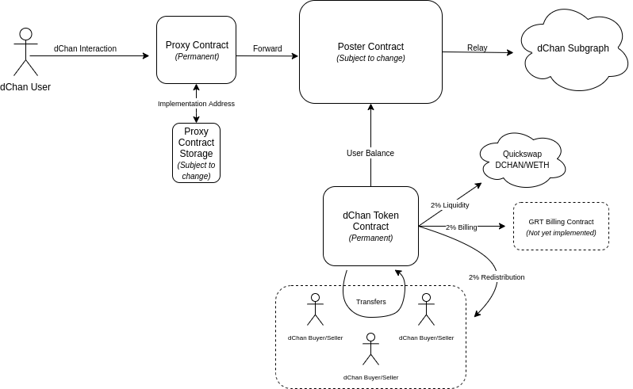

# dchan-subgraph

Official [dchan](https://dchan.network) subgraph.

## Development

* `./bin/docker_start_node.sh`
* Once started open a new terminal and `./bin/docker_bash.sh`
  * `cp subgraph.ganache.yaml subgraph.yaml`
  * `./bin/deploy.sh`
    * Change `address` in `subgraph.yaml` everytime you deploy a new contract
  * `./bin/subgraph_deploy.sh` to update the subgraph

In case of problems refer to [this guide](https://thegraph.com/docs/developer/quick-start) or to the google of internet

## Smart Contract Design
Smart contract design is based on a simplified version of [The Graph's implementation, which can be found here](https://etherscan.io/address/0xadca0dd4729c8ba3acf3e99f3a9f471ef37b6825#code). Simply put, the design looks like this:

This allows for a number of advantages when compared to traditional contract schemas:
* A permanent address, always residing at the DCHAN proxy contract address.
* Upgradability in the event that the `Poster` relay contract needs to be changed or upgraded, *without affecting token balances*.
* Ability to renounce ownership of the Proxy and Token contracts once the network is self-sustaining.
* Exposure of token balances, secured by ETH, to the dChan subgraph via a `balanceOf` contract call to the token contract, emitted by the event.

## Credits

Based on [@DennisonBertram](https://twitter.com/DennisonBertram/)'s [`poster-token`](https://github.com/crazyrabbitLTC/poster-token).